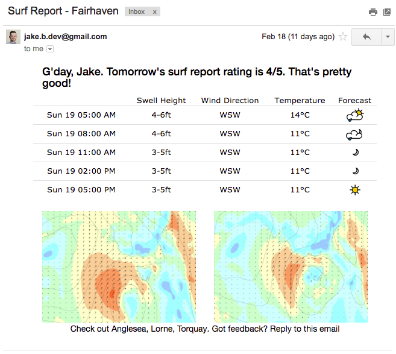

# Randy Mailer

Randy is a scheduled Mailer implemented in Ruby on Rails. It sends an email to preset users with the forecast.

## About

This mailer will check if the surf forecast in Fairhaven is good in the next 24 hours. If the surf is good, a surf forecast is sent via email.
The email includes the surf height, temperatures, forecast & and wind graphs.



## Configuration

- Ruby 2.7.1
- Rails 5.0.1

## Setup

```bash
# install ruby dependancies
bundle install
```

## Usage

```bash
# trigger emails
rake send_surf_report
```

## Services used

- Heroku. For hosting & scheduling. Can be configured to execute a rake task every 10 minutes, hour or day.
- [Magic Seaweed API](magicseaweed.com/developer/forecast-api). Used to acquire all surf data. Data is already formatted and processed.

## Installation & Deployment

- Install [Rails](http://railsapps.github.io/installing-rails.html)
- Configure smtp settings
- Serve locally or with [Heroku](https://www.heroku.com)
- If serving locally, use the [whenever gem](https://github.com/javan/whenever) to configure chronjobs easily.

## How to Contribute

1. Fork it
2. Create your feature branch (git checkout -b my-newfeature)
3. Commit your changes (git commit -am 'Some helpful feature')
4. Push (git push origin my-new-feature)
5. Create a new Pull Request
